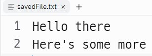

# Saving to Files

👉 Now let's get some input, store it in a variable, and write it to the file.

```python
f = open("savedFile.txt", "w")
whatText = input("> ")
f.write(whatText)
f.close()

```

## Preventing Overwrite

We're going to change the file permissions from 'w' to 'a+'.  

'a' means *append* - add to the end of the file.

However, if the file doen't exist, then it will crash.

'a+' means 'add to the end of the file, or create a new one if it doesn't exist'.

👉 Here's the amended code with the change on line 1:

```python
f = open("savedFile.txt", "a+")
whatText = input("> ")
f.write(whatText)
f.close()

```
The problem with this is that it just glues the second input straight on to the first.  Like this:


So we need some.......

## New Lines

👉 We can use our old friend, the fString, to format a new line.  I've used the `\n` new line character.

```python
f = open("savedFile.txt", "a+")
whatText = input("> ")
f.write(f"{whatText}\n")
f.close()
```

That's better.



```python
f = open("savedFile.txt", "a+")
whatText = input("> ")
f.write(f"{whatText}\n")
f.close()
```
### Make sure you follow all three steps so the file saves.
